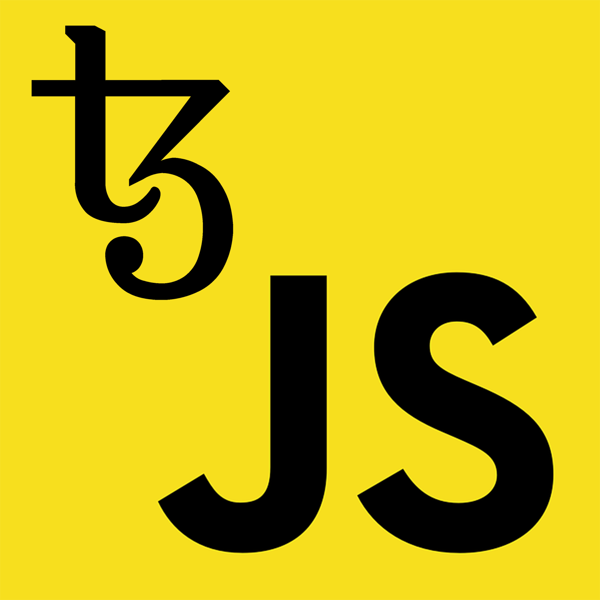

<!-- PROJECT LOGO -->

<p align="center">
  <a href="https://github.com/AndrewKishino/sotez">
    
  </a>
  <h3 align="center">Sotez</h3>
  <p align="center">
    A JavaScript Library for Tezos
  </p>
</p>

 [](https://travis-ci.org/AndrewKishino/sotez)

<!-- TABLE OF CONTENTS -->

## Table of Contents

- [Documentation](#documentation)
- [Node Version](#node-version)
- [Getting Started](#getting-started)
  - [Installation](#installation)
  - [Usage](#usage)
    - [Initialize](#initialize)
    - [Query](#query)
    - [Sign](#sign)
      - [In-memory Key](#in-memory-key)
      - [Ledger](#ledger)
- [Examples](#examples)
  - [Create a transfer operation](#create-a-transfer-operation)
  - [Set a new delegate](#set-a-new-delegate)
  - [Load and inspect a contract](#load-and-inspect-a-contract)
  - [Inject an operation](#inject-an-operation)
  - [Inject a batch operation](#inject-a-batch-operation)
  - [Activate a faucet account](#activate-a-faucet-account)
- [Additional Modules](#additional-modules)
  - [cryptoUtils](#cryptoutils)
  - [Key](#key)

## Documentation

More detailed documentation can be found in the [Documentation](https://andrewkishino.github.io/sotez/modules.html).

## Node Version

Prerequisites: [Node.js](https://nodejs.org/) (`>=8.0.0`) or a modern web browser

Sotez is an isomorphic JavaScript library that can be used seamslessly across both the server and client environments.

## Getting Started

### Installation

You can install Sotez using npm:

```sh
npm install sotez
```

### Usage

#### Initialize

Import Sotez and initialize a new instance:

```js
import { Sotez } from 'sotez';

const tezos = new Sotez('https://testnet-tezos.giganode.io');
```

Sotez can be initialized with the following arguments:

```js
const tezos = new Sotez(provider, moduleOptions);
```

- **provider**: The address of the rpc server of the Tezos node
- **moduleOptions**: The configurable options to set for an initialized instance
  - **defaultFee**: The default fee to apply to transactions
  - **useMutez**: Use mutez values when referring to balance or amounts
  - **useLimitEstimator**: Use an estimator to determine gas and storage limits
  - **chainId**: The chain ID to interact with
  - **localForge**: Forge operations locally, without an rpc server
  - **validateLocalForge**: Forge operations locally, but verify against the rpc server
  - **debugMode**: Sets debug mode

For example, you can provide additional options when initializing a new instance:

```js
// New instance initialized with default values
const tezos = new Sotez('https://testnet-tezos.giganode.io', {
  defaultFee: 1420,
  useMutez: true,
  useLimitEstimator: true,
  chainId: 'main',
  debugMode: false,
  localForge: true,
  validateLocalForge: false,
});
```

#### Query

After we have initialized an instance of Sotez, we can start querying the blockchain:

```js
// Get the current head or the latest block
const head = await tezos.getHead();

// Get the current balance of a Tezos address
const balance = await tezos.getBalance('tz1e148HC7RUtCcZRNb4UnjNoRjyyxB8pNps');

// Query the RPC directly
const previousBalance = await tezos.query(
  '/chains/main/blocks/head~30/context/contracts/tz1e148HC7RUtCcZRNb4UnjNoRjyyxB8pNps/balance',
);
```

#### Sign

##### In-memory Key

In order to perform any actions that require a signature (transfer, delegate, originate, etc.) we need to import a secret key:

```js
await tezos.importKey('edsk3Z2t7t1XimympW62RmUDQeBxn9dw3pQdxxhpAGngmkjiFuXUAj');
```

If you need to import an encrypted key, you can also provide a passphrase as the second argument to the `importKey` method:

```js
await tezos.importKey(
  'edesk1RK4W4Qdo6tUwf5oB1swQMXnxJwPo6vWDmWNJEQUbsfA4auJiXdWkXk3JWyzNPAugcQaQuoui1hpNfWfYtK',
  'password',
);
```

##### Ledger

You may instead decide that you would like to sign operations using a Ledger device. In that case, you will need to also install the required [Transport](https://github.com/LedgerHQ/ledger-live/tree/develop/libs/ledgerjs#ledgerhqhw-transport-) for the environment you are importing from:

```sh
npm install @ledgerhq/hw-transport-node-hid
npm install @ledgerhq/hw-transport-webusb
npm install @ledgerhq/hw-transport-u2f
```

Importing a ledger requires that you have the Tezos ledger wallet app installed and the app open on the ledger. The Transport argument is the only required argument, but you can define the BIP44 path as the second argument, and the curve (`tz1`, `tz2`, `tz3`) as the third. If the BIP44 path is not provided, it will use the zero index value (`"44'/1729'/0'/0'"`).

```js
// Import the required transport for the appropriate environment
import TransportNodeHid from '@ledgerhq/hw-transport-node-hid';

const tezos = new Sotez('https://testnet-tezos.giganode.io');

await tezos.importLedger(TransportNodeHid, "44'/1729'/0'/0'");
```

If using the require syntax, the transport should be defined as such:

```js
// Import the required transport for the appropriate environment
const TransportNodeHid = require('@ledgerhq/hw-transport-node-hid').default;

const tezos = new Sotez('https://testnet-tezos.giganode.io');

await tezos.importLedger(TransportNodeHid, "44'/1729'/0'/0'");
```

### Examples

##### Create a transfer operation

```js
import { Sotez } from 'sotez';

const tezos = new Sotez('https://testnet-tezos.giganode.io');

const transfer = async () => {
  await tezos.importKey(
    'edsk3Z2t7t1XimympW62RmUDQeBxn9dw3pQdxxhpAGngmkjiFuXUAj',
  );
  const { hash } = await tezos.transfer({
    to: 'tz1e148HC7RUtCcZRNb4UnjNoRjyyxB8pNps',
    amount: 1,
  });

  console.log(`Waiting for operation ${hash}`);
  const blockHash = await tezos.awaitOperation(hash);
  console.log(`Operation found in block ${blockHash}`);
};

transfer();
```

##### Set a new delegate

```js
import { Sotez } from 'sotez';

const tezos = new Sotez('https://testnet-tezos.giganode.io');

const delegate = async () => {
  await tezos.importKey(
    'edsk3Z2t7t1XimympW62RmUDQeBxn9dw3pQdxxhpAGngmkjiFuXUAj',
  );
  const { hash } = await tezos.setDelegate({
    delegate: 'tz1e148HC7RUtCcZRNb4UnjNoRjyyxB8pNps',
  });

  console.log(`Waiting for operation ${hash}`);
  const blockHash = await tezos.awaitOperation(hash);
  console.log(`Operation found in block ${blockHash}`);
};

delegate();
```

##### Load and inspect a contract

```js
import { Sotez } from 'sotez';

const tezos = new Sotez('https://testnet-tezos.giganode.io');

const contract = async () => {
  await tezos.importKey(
    'edsk3Z2t7t1XimympW62RmUDQeBxn9dw3pQdxxhpAGngmkjiFuXUAj',
  );

  // Load contract
  const contract = await sotez.loadContract(
    'KT1DE4txbxNbayiLLs1Z8ruyyNZr11wDMUDo',
  );

  // Retrieve contract storage
  const storage = await contract.storage();

  // List defined contract methods
  const { methods } = contract;

  // Get big map keys
  const bigMapKey = ['tz1ctUVPHDnBYUaAHVTVb7LDB4wDjPGweC7u', 0];
  const bigMapValue = await storage.sLedger.get(bigMapKey);

  // Send contract operation
  await contract.methods
    .transfer('tz1P1n8LvweoarK3DTPSnAHtiGVRujhvR2vk', 100)
    .send({
      fee: 100000,
      gasLimit: 800000,
      storageLimit: 60000,
    });
};

contract();
```

##### Inject an operation

```js
import { Sotez } from 'sotez';

const tezos = new Sotez('https://testnet-tezos.giganode.io');

const send = async () => {
  await tezos.importKey(
    'edsk3Z2t7t1XimympW62RmUDQeBxn9dw3pQdxxhpAGngmkjiFuXUAj',
  );
  const operation = {
    kind: 'transaction',
    fee: 1420,
    gas_limit: 10600,
    storage_limit: 300,
    amount: 1000,
    destination: 'tz1RvhdZ5pcjD19vCCK9PgZpnmErTba3dsBs',
  };

  const { hash } = await sotez.sendOperation({ operation });

  console.log(`Waiting for operation ${hash}`);
  const blockHash = await tezos.awaitOperation(hash);
  console.log(`Operation found in block ${blockHash}`);
};

send();
```

##### Inject a batch operation

```js
import { Sotez } from 'sotez';

const tezos = new Sotez('https://testnet-tezos.giganode.io');

const send = async () => {
  await tezos.importKey(
    'edsk3Z2t7t1XimympW62RmUDQeBxn9dw3pQdxxhpAGngmkjiFuXUAj',
  );

  // Define multiple operation objects
  const operations = [
    {
      kind: 'transaction',
      fee: 1420,
      gas_limit: 10600,
      storage_limit: 300,
      amount: 1000,
      destination: 'tz1RvhdZ5pcjD19vCCK9PgZpnmErTba3dsBs',
    },
    {
      kind: 'transaction',
      fee: 1420,
      gas_limit: 10600,
      storage_limit: 300,
      amount: 1000,
      destination: 'tz1RvhdZ5pcjD19vCCK9PgZpnmErTba3dsBs',
    },
  ];

  const { hash } = await sotez.sendOperation({ operation: operations });

  console.log(`Waiting for operation ${hash}`);
  const blockHash = await tezos.awaitOperation(hash);
  console.log(`Operation found in block ${blockHash}`);
};

send();
```

##### Activate a faucet account

```js
import { Sotez, cryptoUtils } from 'sotez';

const tezos = new Sotez('https://testnet-tezos.giganode.io');

const accountJSON = {
  mnemonic: [
    'raw',
    'peace',
    'visual',
    'boil',
    'prefer',
    'rebel',
    'anchor',
    'right',
    'elegant',
    'side',
    'gossip',
    'enroll',
    'force',
    'salmon',
    'between',
  ],
  secret: '0c5fa9a3d707acc816d23940efdef01aa071bdc6',
  amount: '12358548903',
  pkh: 'tz1eQV2GqDTY7dTucnjzNgvB5nP4H5c7Xr5m',
  password: 'wc0W7jn3Vf',
  email: 'gfjilgzu.trfhzzzk@tezos.example.org',
};

const activate = async () => {
  const keys = await cryptoUtils.generateKeys(
    accountJSON.mnemonic.join(' '),
    `${accountJSON.email}${accountJSON.password}`,
  );

  const { hash } = await tezos.activate(accountJSON.pkh, accountJSON.secret);

  console.log(`Waiting for operation ${hash}`);
  const blockHash = await tezos.awaitOperation(hash);
  console.log(`Operation found in block ${blockHash}`);
};

activate();
```

### Additional Modules

#### cryptoUtils

This module contains some fundamental crypto utilities that can be used to sign messages, verify messages, extract keys, encrypt keys, validate addresses, or generate new keys.

##### extractKeys

```js
import { cryptoUtils } from 'sotez';

const extract = async () => {
  const extractedKeys = await cryptoUtils.extractKeys(
    'edsk3Z2t7t1XimympW62RmUDQeBxn9dw3pQdxxhpAGngmkjiFuXUAj',
  );
  return extractedKeys;
  // {
  //   sk: string;
  //   pk: string;
  //   pkh: string;
  // }
};

extract();
```

Keys that are encrypted can also be extracted by providing a passphrase as the second argument. Encrypted keys are encrypted with a salt. When extracting encrypted keys, the salt is also provided in order to be able to re-encrypt the secret key to produce the similar salted encrypted key.

```js
import { cryptoUtils } from 'sotez';

const extract = async () => {
  const extractedKeys = await cryptoUtils.extractKeys(
    'edesk1RK4W4Qdo6tUwf5oB1swQMXnxJwPo6vWDmWNJEQUbsfA4auJiXdWkXk3JWyzNPAugcQaQuoui1hpNfWfYtK',
    'password',
  );
  return extractedKeys;
  // {
  //   sk: string;
  //   esk: string;
  //   pk: string;
  //   pkh: string;
  //   salt: Uint8Array;
  // }
};

extract();
```

##### generateKeys

You can generate a new set of keys given a mnemonic and an optional password.
**NOTE**: The passphrase provided to `generateKeys` is only used to generate the keys and not encrypt them. In order to encrypt the secret key, you need to call `encryptSecretKey`:

```js
import { cryptoUtils } from 'sotez';

const generate = async () => {
  // Generate a new random mnemonic
  const mnemonic = cryptoUtils.generateMnemonic();
  // 'raw peace visual boil prefer rebel anchor right elegant side gossip enroll force salmon between'

  const keys = await cryptoUtils.generateKeys(mnemonic, 'bip39_seed_password');
  // {
  //   sk: string;
  //   pk: string;
  //   pkh: string;
  // }

  const encryptedSecretKey = cryptoUtils.encryptSecretKey(keys.sk, 'password');

  return {
    ...keys,
    esk: encryptedSecretKey,
  };
};

generate();
```

#### Key

This module is a class representation of the cryptographic functionalities of a Tezos key. When initialized with a secret key or ledger, the basic functions of this class allows the retrieval of the public key, public key hash, secret key, and encrypted secret key. It also can sign messages and verify them against a public key.

```js
import { Key, magicBytes } from 'sotez';

const setupKey = async () => {
  const key = new Key({
    key: 'edskRhQtHKMHVf3FDbnqhorMMVXrvgTVNJinVx6WQXb8RVXdKG5PVL5R7JsXU4Sc24wgG5Q5csQBcCQVVd98iSF1QJWjoHLW11',
  });
  await key.ready;

  const publicKey = key.publicKey();
  const publicKeyHash = key.publicKeyHash();
  const secretKey = key.secretKey();
  const encryptedSecretKey = key.secretKey('password');

  const { bytes, magicBytes, prefixSig } = await key.sign(
    '051d7ba791fbe8ccfb6f83dd9c760db5642358909eede2a915a26275e6880b9a6c02a2dea17733a2ef2685e5511bd3f160fd510fea7db50edd8122997800c0843d016910882a9436c31ce1d51570e21ae277bb8d91b800006c02a2dea17733a2ef2685e5511bd3f160fd510fea7df416de812294cd010000016910882a9436c31ce1d51570e21ae277bb8d91b800ff020000004602000000410320053d036d0743035d0100000024747a31655935417161316b5844466f6965624c3238656d7958466f6e65416f5667317a68031e0743036a0032034f034d031b6c02a2dea17733a2ef2685e5511bd3f160fd510fea7dd016df8122a6ca010000016910882a9436c31ce1d51570e21ae277bb8d91b800ff020000003e02000000390320053d036d0743035d0100000024747a3161575850323337424c774e484a6343443462334475744365766871713254315a390346034e031b6c02a2dea17733a2ef2685e5511bd3f160fd510fea7dc916e08122dec9010000016910882a9436c31ce1d51570e21ae277bb8d91b800ff0200000013020000000e0320053d036d053e035d034e031b',
    magicBytesMap.generic,
  );

  const verified = await key.verify(`${magicBytes}${bytes}`, prefixSig);
  // true
};

setupKey();
```

If you want to use a ledger with the Key module, you can initialize the class with a ledger transport. This will only provide the module with the public key. When calling `key.sign(...)`, the ledger will provide the signed data.

```js
import { Key } from 'sotez';
import TransportNodeHid from '@ledgerhq/hw-transport-node-hid';

const setupKey = async () => {
  const key = new Key({ ledgerTransport: TransportNodeHid });
  await key.ready;
};

setupKey();
```

You can also load a fundraiser account into the key

```js
import { Key } from 'sotez';

const FUNDRAISER_ACCOUNT = {
  mnemonic: [
    'spatial',
    'behave',
    'income',
    'advice',
    'guard',
    'isolate',
    'circle',
    'valve',
    'tag',
    'foot',
    'decline',
    'subway',
    'furnace',
    'ancient',
    'output',
  ],
  secret: '8731b6b8cd4b7b67e1e4b76010d8e9f13500ccb5',
  amount: '16474172439',
  pkh: 'tz1UJesXieRG8cZHFUad63RwUfFqh9cwGzvW',
  password: '9zojwTc88E',
  email: 'qvchryer.svikvvex@tezos.example.org',
};

const setupKey = async () => {
  const key = new Key({
    key: FUNDRAISER_ACCOUNT.mnemonic.join(' '),
    passphrase: FUNDRAISER_ACCOUNT.password,
    email: FUNDRAISER_ACCOUNT.email,
  });
  await key.ready;
};

setupKey();
```
